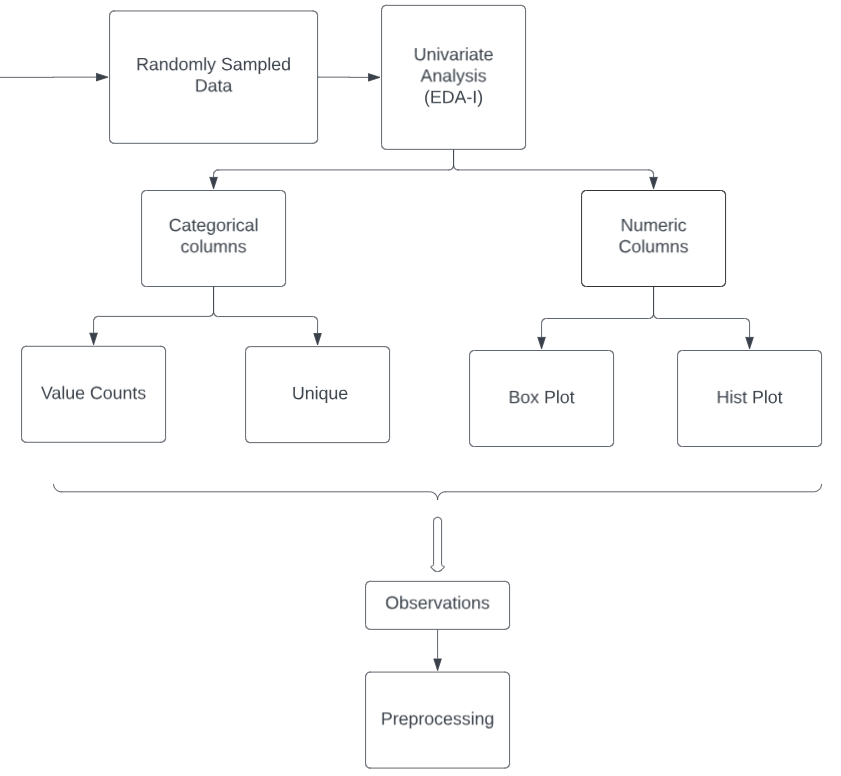
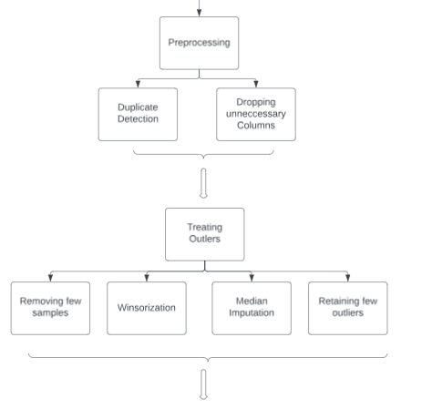
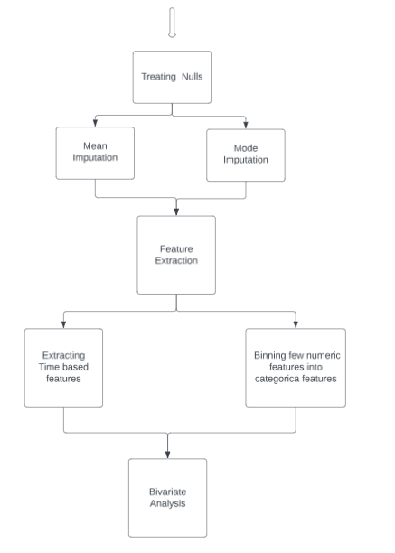
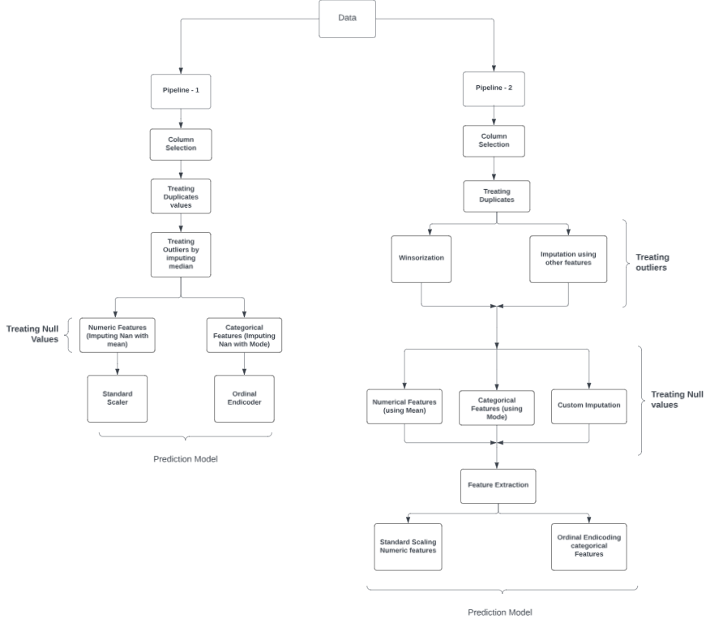

# US Car Accidents Analysis and Prediction
- The work aims to predict severity level of car accident in the USA by analyzing various
factors contributing to the accidents such as weather conditions, road features (like road crossing, junction, signals), time and location, etc.

# Dataset
- *source*: [US Car Accidents, kaggle](https://www.kaggle.com/datasets/sobhanmoosavi/us-accidents)
- *Dataset dimensions*: 7.7 million entries x 40 columns
- *Problem Type*: Classification
- *Target*: Severity of accident & its impact on traffic (1 - lowest severity, to, 4 - highest severity)

# Workflow
### Step 1 - Sampling
- To mitigate two problems
  1. Immensely large dataset
  2. Highly imbalanced samples

### Step 2 - Univariate Analysis

### Step 3 - Preprocessing
- Applying the learnings to treat noise in the data

  
  

### Step 4 - Creating Pipelines

# Models Selection
### Models Used
- Decision Tree
- Random Forest
- AdaBoost
- Voting Classifier

### Classification Metric
- Precision-Recall curve
  - The precision-recall curves provide a more informative analysis, especially in imbalanced datasets, compared to traditional ROC curves.
  - label_binarize of sklearn has been used to convert the multiclass labels to binary format for each class, inorder to plot PR-curve for each class.
